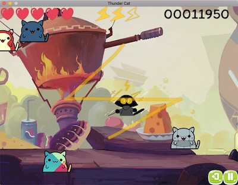

# NEKOPARO
A SIMPLE GAME WITH **SDL2**.  
You can play it on any platform (Windows or MacOS or Linux).

###Compile
```
cd NEKOPARO
g++ -O3 -std=c++11 src/*.cpp -Isrc/ -lSDL2 -lSDL2_ttf -lSDL2_mixer -lSDL2_image -o nekoparo
./nekoparo
```
Also you can open with VS or Xcode, just add SDL2, SDL2_image, SDL2_TTF, SDL2_mixer.

###Screenshot

